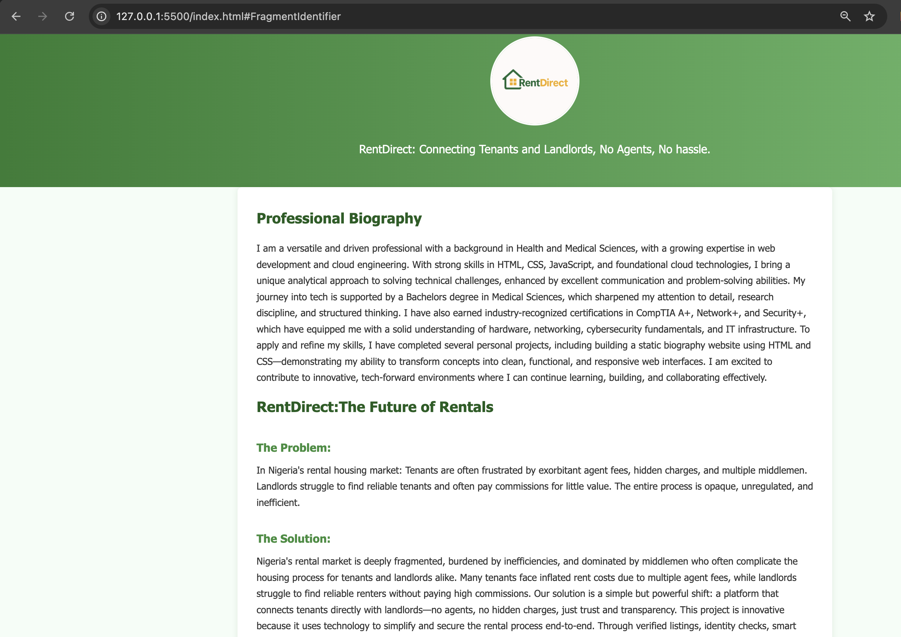

# RentDirect Deployment on AWS Ubuntu Server

## Overview

This README documents the process of setting up a secure Ubuntu server on AWS, configuring an Apache2 web server,
and deploying the **RentDirect** project — a simple, static web-based platform that connects tenants and landlords directly.

---

## Tools & Technologies

- AWS EC2 (Ubuntu 20.04 LTS)
- Apache2
- HTML, CSS, JavaScript\*\*
- SSH
- Ubuntu Terminal

---

## Step-by-Step Deployment Process

### 1. Launching an EC2 Ubuntu Server

Log in to AWS Management Console
Navigate to EC2 → Instances.
Click Launch Instance" and choose:

- Ubuntu Server 20.04 LTS
- t2.micro (free tier)
  Create an SSH key-pair stored in the .ssh directory on my local machcine
  Open port 22 (SSH) and port 80 (HTTP) in the security group.
  Launch and wait for the instance to initialize.

### 2. Connect to Your Server via SSH

chmod 400 your-key.pem
ssh -i "your-key.pem" ubuntu@my-ec2-public-ip

### 3. Update and Install Apache2

sudo apt update && sudo apt upgrade -y
sudo apt install apache2 -y

### 4. Confirm Apache2 is working

systemctl status apache2

### 5. Upload my Project directory unto my server:

Achieved this by clearing the default Apache index page;
sudo rm /var/www/html/index.html

### 6. Adjusted the directory permissions:

sudo chmod -R 755 /var/www/html/

### 7. ®estarting my apache2 server to ensure my chnages took effect:

systemctl restart Apache2

### 8. Verifying my final result:

Visited my public IP address where my project is hosted.
http://18.203.233.196

### 9. Project Preview:

